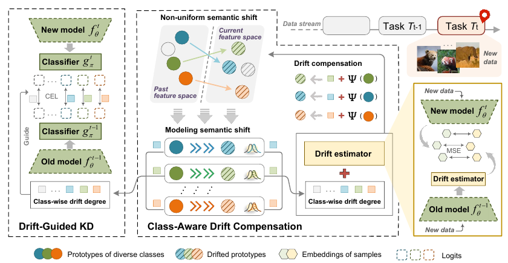

# CADC: Class-Aware Drift Compensation for Non-Uniform Semantic Shift in Continual Learning

[](http://cvpr.thecvf.com/) [](https://pytorch.org/)

> **Accepted by CVPR 2026 Findings**
>
> This repository provides an implementation of **CADC**, a drift compensation method for **Exemplar-Free Class-Incremental Learning (EFCIL)**.
>
> The codebase is currently being reorganized and will be released after the paper is online.

## Overview

In EFCIL, old raw samples are not replayed, and only intermediate representations (e.g., class prototypes) are retained. As the backbone is updated with new tasks, these stored representations drift in the feature space.

Most drift compensation methods assume roughly uniform semantic shift across classes. CADC is designed for a more realistic setting: **non-uniform semantic shift** under random class streams.

**CADC** addresses this with two key ideas:

- **Class-Aware Drift Compensation**: estimates class-wise drift and applies adaptive prototype compensation with different strengths per class.
- **Drift-Guided Knowledge Distillation**: uses drift intensity to modulate distillation constraints, improving the stability-plasticity trade-off.



##### CADC is lightweight, compatible with standard EFCIL training pipelines, and effective under non-uniform semantic shift.

---

## Paper and Citation

If you find this work useful in your research, we would greatly appreciate it if you could cite our paper:

```bibtex
@InProceedings{Xu_2026_CVPR,
    author    = {Xu, Fankang and Jin, Lu and Sun, Yanpeng and Xuan, Shiyu and Li, Zechao},
    title     = {Class-Aware Drift Compensation for Non-Uniform Semantic Shift in Continual Learning},
    booktitle = {Proceedings of the IEEE/CVF Conference on Computer Vision and Pattern Recognition (CVPR) Findings},
    month     = {June},
    year      = {2026},
    pages     = {7717--7727}
}
```

---

## Acknowledgement

This project is mainly based on [PyCIL](https://github.com/LAMDA-CL/PyCIL).
